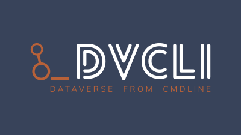

# dvcli

An experiment in creating an all-in-one CLI application for using and administrating Dataverse

See also community mailing list: https://groups.google.com/forum/#!topic/dataverse-community/etN5URWos44

## Installation

For now, being an experiment without any releases, simply:

```
pip install git+https://github.com/poikilotherm/dvcli.git
```

## Plugins

A list of available plugins, which extend `dvcli` in fields beyond core scope:

- Kubernetes: https://github.com/poikilotherm/dvcli-plugin-k8s

## Development

- `git clone` this repository
- Create a virtualenv or use [asdf](https://asdf-vm.com) to create non-system python env
- Run `pip install --editable .` from the cloned repo root to install
- Run `dvcli`
- When hacking on the files, you can simply run the tool again - the choosen
  installation method enables magically using it without reinstall.

## Configuration

All parameters, options etc for any command can be given via:

1. Defaults (within the app)
2. YAML configuration file in operating system locations
3. YAML configuration file at any arbitrary location (use `--config` or `DVCLI_CONFIG=...`)
4. Environment variable with prefix `DVCLI_`
5. Commandline option.

The order of appearance above corresponds to the priority of the source, lowest
to highest. Values are merged according to their priority. Key hashes in YAML files
are merged, but not arrays or hash values (so no deep merge).

## Ideas

- Can be extended by others using https://github.com/click-contrib/click-plugins.
  Adding support here is easy. That way we can split efforts but still have a
  common ground.
- Create a command to set database configuration options in an idempotent manner.
- Maybe add a XML generator for JVM options to ease their configuration?
